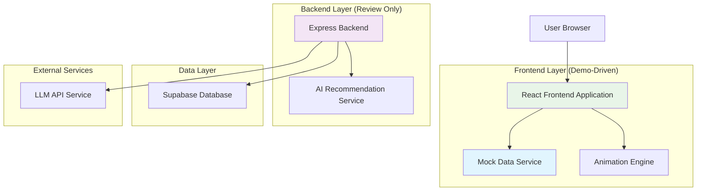
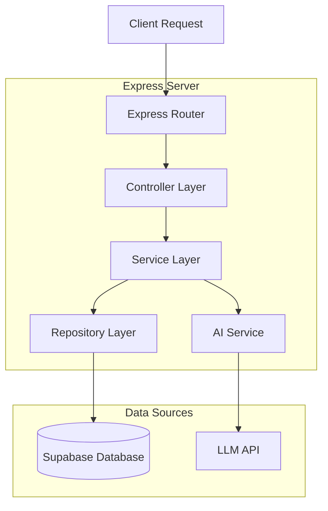
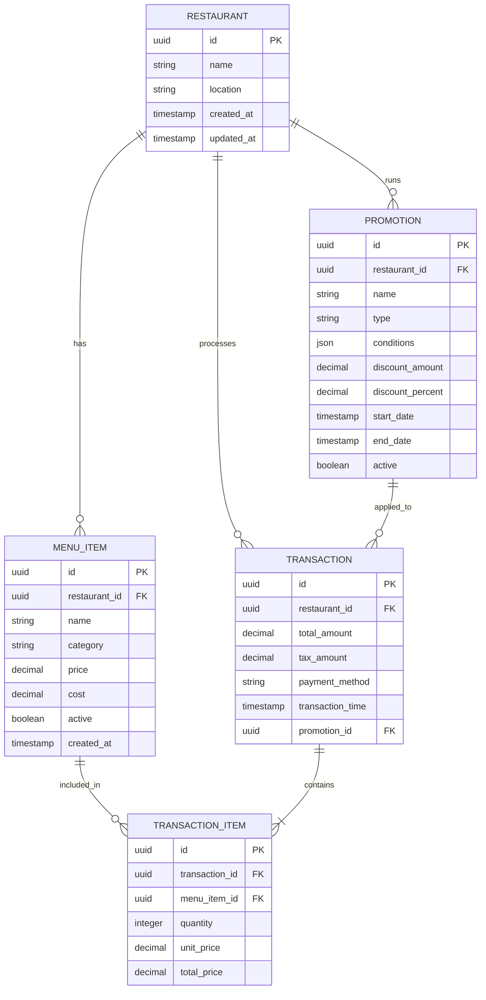

# Restaurant GM Dashboard - Technical Architecture Document

## 1. Architecture Design



## 2. Technology Description

- **Frontend**: React@18 + TypeScript@5 + Vite@5 + TailwindCSS@3 + Framer Motion@10
- **Backend**: Express@4 + TypeScript@5 + Supabase SDK
- **Database**: Supabase (PostgreSQL)
- **AI Integration**: OpenAI API (configurable)
- **Charts**: Recharts@2
- **State Management**: React Context + useReducer

## 3. Route Definitions

| Route | Purpose |
|-------|---------|
| / | Main dashboard page with all components and mock data interactions |
| /api/health | Backend health check endpoint |

## 4. API Definitions

### 4.1 Core API Endpoints

**Dashboard Data Retrieval**
```
GET /api/kpis
```
Response:
| Param Name | Param Type | Description |
|------------|------------|-------------|
| total_sales | number | Total sales amount |
| avg_ticket_size | number | Average ticket size |
| gross_margin_percent | number | Gross margin percentage |
| guest_satisfaction | number | Guest satisfaction score |
| deltas | object | Percentage changes for all KPIs |

**Category Performance**
```
GET /api/categories
```
Response:
| Param Name | Param Type | Description |
|------------|------------|-------------|
| categories | array | List of category objects with sales, margin, and status |

**AI Recommendations**
```
GET /api/recommendations?scenario={scenario}
```
Request:
| Param Name | Param Type | isRequired | Description |
|------------|------------|------------|-------------|
| scenario | string | false | Day scenario (normal, rainy, hot, shortage, promo) |

Response:
| Param Name | Param Type | Description |
|------------|------------|-------------|
| recommendations | array | List of AI-generated promotional suggestions |
| snapshot | object | Current state snapshot for comparison |

**Apply Recommendation**
```
POST /api/apply
```
Request:
| Param Name | Param Type | isRequired | Description |
|------------|------------|------------|-------------|
| recommendation_id | string | true | ID of the recommendation to apply |
| scenario | string | false | Current day scenario |

Response:
| Param Name | Param Type | Description |
|------------|------------|-------------|
| before | object | State before applying recommendation |
| after | object | Projected state after applying recommendation |
| delta | object | Calculated differences and improvements |

**Transaction Data**
```
GET /api/transactions
```
Response:
| Param Name | Param Type | Description |
|------------|------------|-------------|
| transactions | array | Recent transaction data for AI analysis |

**System Snapshot**
```
GET /api/snapshot
```
Response:
| Param Name | Param Type | Description |
|------------|------------|-------------|
| timestamp | string | Current snapshot timestamp |
| kpis | object | Current KPI values |
| categories | array | Current category performance |
| active_promos | array | Currently active promotions |

### 4.2 TypeScript Type Definitions

```typescript
interface KPIData {
  total_sales: number;
  avg_ticket_size: number;
  gross_margin_percent: number;
  guest_satisfaction: number;
  deltas: {
    total_sales_pct: number;
    avg_ticket_pct: number;
    gross_margin_pct: number;
    guest_sat_pct: number;
  };
}

interface CategoryData {
  name: string;
  sales: number;
  margin_pct: number;
  status: 'Green' | 'Yellow' | 'Red';
}

interface RecommendationScenario {
  id: string;
  trigger: string;
  recommendation: string;
  expected_uplift_margin: number;
  impact: {
    category: string;
    new_sales: number;
    margin_gain: number;
  };
}

interface LeaderboardData {
  top_item: {
    name: string;
    sales: number;
  };
  needs_focus: {
    name: string;
    sales: number;
  };
}

interface DashboardState {
  kpis: KPIData;
  categories: CategoryData[];
  scenarios: RecommendationScenario[];
  leaderboard: LeaderboardData;
  appliedRecommendations: string[];
  currentScenario: string;
  isBeforeAfterMode: boolean;
}
```

## 5. Server Architecture Diagram



## 6. Data Model

### 6.1 Data Model Definition



### 6.2 Data Definition Language

**Restaurant Table**
```sql
-- Create restaurant table
CREATE TABLE restaurants (
    id UUID PRIMARY KEY DEFAULT gen_random_uuid(),
    name VARCHAR(255) NOT NULL,
    location VARCHAR(255),
    created_at TIMESTAMP WITH TIME ZONE DEFAULT NOW(),
    updated_at TIMESTAMP WITH TIME ZONE DEFAULT NOW()
);

-- Grant permissions
GRANT SELECT ON restaurants TO anon;
GRANT ALL PRIVILEGES ON restaurants TO authenticated;
```

**Menu Items Table**
```sql
-- Create menu_items table
CREATE TABLE menu_items (
    id UUID PRIMARY KEY DEFAULT gen_random_uuid(),
    restaurant_id UUID REFERENCES restaurants(id),
    name VARCHAR(255) NOT NULL,
    category VARCHAR(100) NOT NULL,
    price DECIMAL(10,2) NOT NULL,
    cost DECIMAL(10,2) NOT NULL,
    active BOOLEAN DEFAULT true,
    created_at TIMESTAMP WITH TIME ZONE DEFAULT NOW()
);

-- Create indexes
CREATE INDEX idx_menu_items_restaurant_id ON menu_items(restaurant_id);
CREATE INDEX idx_menu_items_category ON menu_items(category);
CREATE INDEX idx_menu_items_active ON menu_items(active);

-- Grant permissions
GRANT SELECT ON menu_items TO anon;
GRANT ALL PRIVILEGES ON menu_items TO authenticated;
```

**Transactions Table**
```sql
-- Create transactions table
CREATE TABLE transactions (
    id UUID PRIMARY KEY DEFAULT gen_random_uuid(),
    restaurant_id UUID REFERENCES restaurants(id),
    total_amount DECIMAL(10,2) NOT NULL,
    tax_amount DECIMAL(10,2) DEFAULT 0,
    payment_method VARCHAR(50),
    transaction_time TIMESTAMP WITH TIME ZONE DEFAULT NOW(),
    promotion_id UUID REFERENCES promotions(id)
);

-- Create indexes
CREATE INDEX idx_transactions_restaurant_id ON transactions(restaurant_id);
CREATE INDEX idx_transactions_time ON transactions(transaction_time DESC);
CREATE INDEX idx_transactions_promotion ON transactions(promotion_id);

-- Grant permissions
GRANT SELECT ON transactions TO anon;
GRANT ALL PRIVILEGES ON transactions TO authenticated;
```

**Transaction Items Table**
```sql
-- Create transaction_items table
CREATE TABLE transaction_items (
    id UUID PRIMARY KEY DEFAULT gen_random_uuid(),
    transaction_id UUID REFERENCES transactions(id),
    menu_item_id UUID REFERENCES menu_items(id),
    quantity INTEGER NOT NULL DEFAULT 1,
    unit_price DECIMAL(10,2) NOT NULL,
    total_price DECIMAL(10,2) NOT NULL
);

-- Create indexes
CREATE INDEX idx_transaction_items_transaction_id ON transaction_items(transaction_id);
CREATE INDEX idx_transaction_items_menu_item_id ON transaction_items(menu_item_id);

-- Grant permissions
GRANT SELECT ON transaction_items TO anon;
GRANT ALL PRIVILEGES ON transaction_items TO authenticated;
```

**Promotions Table**
```sql
-- Create promotions table
CREATE TABLE promotions (
    id UUID PRIMARY KEY DEFAULT gen_random_uuid(),
    restaurant_id UUID REFERENCES restaurants(id),
    name VARCHAR(255) NOT NULL,
    type VARCHAR(50) NOT NULL, -- 'bundle', 'discount', 'combo'
    conditions JSONB,
    discount_amount DECIMAL(10,2),
    discount_percent DECIMAL(5,2),
    start_date TIMESTAMP WITH TIME ZONE,
    end_date TIMESTAMP WITH TIME ZONE,
    active BOOLEAN DEFAULT true,
    created_at TIMESTAMP WITH TIME ZONE DEFAULT NOW()
);

-- Create indexes
CREATE INDEX idx_promotions_restaurant_id ON promotions(restaurant_id);
CREATE INDEX idx_promotions_active ON promotions(active);
CREATE INDEX idx_promotions_dates ON promotions(start_date, end_date);

-- Grant permissions
GRANT SELECT ON promotions TO anon;
GRANT ALL PRIVILEGES ON promotions TO authenticated;
```

**Initial Demo Data**
```sql
-- Insert demo restaurant
INSERT INTO restaurants (id, name, location) VALUES 
('550e8400-e29b-41d4-a716-446655440000', 'Demo QSR Restaurant', 'Downtown Location');

-- Insert demo menu items
INSERT INTO menu_items (restaurant_id, name, category, price, cost) VALUES 
('550e8400-e29b-41d4-a716-446655440000', 'Classic Burger', 'Sandwiches', 8.99, 3.50),
('550e8400-e29b-41d4-a716-446655440000', 'Premium Coffee', 'Coffee', 3.49, 0.80),
('550e8400-e29b-41d4-a716-446655440000', 'Chocolate Cake', 'Desserts', 4.99, 2.00),
('550e8400-e29b-41d4-a716-446655440000', 'French Fries', 'Fries', 2.99, 1.20),
('550e8400-e29b-41d4-a716-446655440000', 'Soft Drink', 'Drinks', 2.49, 0.60);

-- Insert demo promotions
INSERT INTO promotions (restaurant_id, name, type, conditions, discount_amount, active) VALUES 
('550e8400-e29b-41d4-a716-446655440000', 'Coffee Bundle', 'bundle', '{"items": ["Sandwiches", "Coffee"], "upgrade_price": 1.00}', 1.00, false),
('550e8400-e29b-41d4-a716-446655440000', 'Dessert Discount', 'discount', '{"anchor": "Sandwiches", "target": "Desserts"}', NULL, false),
('550e8400-e29b-41d4-a716-446655440000', 'Cold Drink Combo', 'combo', '{"items": ["Fries", "Drinks"]}', NULL, false);
```

## 7. Frontend Architecture

### 7.1 Component Structure

```
src/
├── components/
│   ├── Dashboard/
│   │   ├── Header.tsx
│   │   ├── KPICards.tsx
│   │   ├── SalesChart.tsx
│   │   ├── AIRecommendations.tsx
│   │   └── Leaderboard.tsx
│   ├── UI/
│   │   ├── Card.tsx
│   │   ├── Button.tsx
│   │   ├── Badge.tsx
│   │   └── Toggle.tsx
│   └── Animations/
│       ├── CounterAnimation.tsx
│       ├── BarGrowth.tsx
│       └── Confetti.tsx
├── hooks/
│   ├── useDashboardState.ts
│   ├── useAnimations.ts
│   └── useMockData.ts
├── services/
│   ├── mockDataService.ts
│   └── apiService.ts
├── types/
│   └── dashboard.ts
└── utils/
    ├── formatters.ts
    └── animations.ts
```

### 7.2 State Management

The application uses React Context with useReducer for state management, maintaining:
- Current dashboard data (KPIs, categories, recommendations)
- Applied recommendations tracking
- Before/after state comparison
- Animation states and triggers
- Day scenario selection

### 7.3 Mock Data Integration

For demo purposes, the frontend uses a mock data service that:
- Provides consistent data structure matching the API specification
- Simulates real-time updates and state changes
- Handles recommendation application logic
- Maintains before/after state for toggle functionality
- Supports different day scenarios without backend dependency