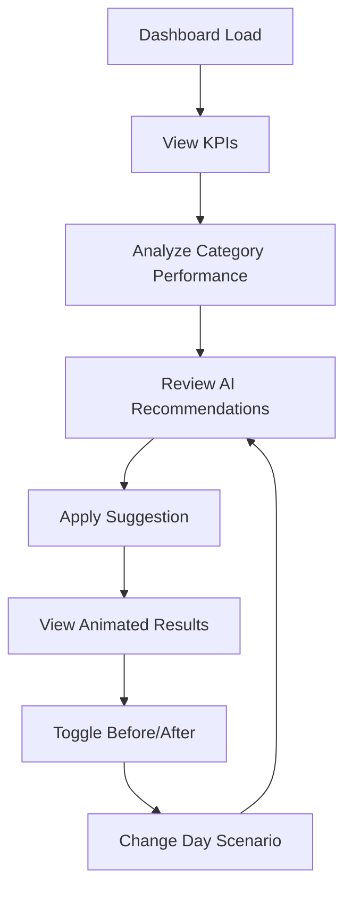

# Restaurant GM Dashboard (QSR) - Product Requirements Document

## 1. Product Overview

A single-page dashboard application for Quick Service Restaurant (QSR) General Managers that demonstrates AI-guided promotional strategies and their impact on key business metrics. The dashboard provides real-time visibility into sales performance, category analysis, and actionable AI recommendations to optimize restaurant operations and profitability.

The product targets restaurant managers who need quick, visual insights to make data-driven decisions during busy operational periods, with a focus on demonstrating measurable improvements through AI-suggested promotional strategies.

## 2. Core Features

### 2.1 User Roles

| Role | Registration Method | Core Permissions |
|------|---------------------|------------------|
| Restaurant GM | Direct access (no authentication for demo) | Full dashboard access, can apply AI recommendations, toggle scenarios |

### 2.2 Feature Module

Our Restaurant GM Dashboard consists of the following main sections:

1. **Header Section**: Restaurant branding, day scenario selector, before/after toggle controls
2. **KPI Dashboard**: Four key performance indicator cards with traffic-light status indicators
3. **Analytics Grid**: Sales performance chart and AI recommendations panel
4. **Performance Summary**: Leaderboard showing top performers and areas needing attention

### 2.3 Page Details

| Page Name | Module Name | Feature description |
|-----------|-------------|---------------------|
| Dashboard | Header | Display "Restaurant GM Dashboard" title with burger emoji, day selector dropdown (Normal Day, Rainy Day, Hot Day, Staff Shortage, Promo Running), before/after toggle switch |
| Dashboard | KPI Cards | Show four metric cards: Total Sales ($12,000, +5.2%), Avg Ticket Size ($8.50, +2.1%), Gross Margin (22%, -1.5%), Guest Satisfaction (82%, +0.8%) with color-coded delta indicators |
| Dashboard | Sales Chart | Display horizontal bar chart for category performance (Sandwiches, Coffee, Desserts, Fries, Drinks) with green/yellow/red status colors and legend |
| Dashboard | AI Recommendations | Present three recommendation cards with trigger chips, uplift estimates, action descriptions, and "Apply Suggestion" buttons |
| Dashboard | Performance Leaderboard | Show top performing item (Sandwiches - $5,000) with green trophy and underperforming item (Desserts - $1,200) with amber warning |
| Dashboard | Interactive Animations | Animate bar chart growth, KPI color changes, margin counter increments, and celebratory confetti on suggestion application |

## 3. Core Process

**Restaurant Manager Daily Workflow:**

1. Manager opens dashboard and views current day performance metrics
2. Reviews KPI cards to identify areas of concern (red indicators)
3. Examines sales performance chart to understand category-level performance
4. Reviews AI recommendations for actionable improvement strategies
5. Applies suggested promotions and observes simulated impact
6. Uses before/after toggle to compare original vs. optimized performance
7. Adjusts day scenario to see different recommendation sets



## 4. User Interface Design

### 4.1 Design Style

- **Primary Colors**: Soft purple gradient background (#8B5CF6 to #A78BFA)
- **Secondary Colors**: Traffic light system (Green: #10B981, Yellow: #F59E0B, Red: #EF4444)
- **Button Style**: Large rounded corners (12px radius), subtle shadows, hover animations
- **Typography**: Inter font family, 24px headers, 16px body text, 14px labels
- **Layout Style**: Card-based design with generous white space, grid system
- **Icons**: Burger emoji for branding, trophy/warning icons, directional arrows for deltas

### 4.2 Page Design Overview

| Page Name | Module Name | UI Elements |
|-----------|-------------|-------------|
| Dashboard | Header | White card with purple accent, burger emoji, dropdown selectors with rounded borders, toggle switch with smooth animation |
| Dashboard | KPI Cards | Four equal-width white cards with subtle shadows, large metric numbers, colored delta indicators with icons, 16px padding |
| Dashboard | Sales Chart | Left panel white card with horizontal bars, color-coded by status, interactive legend, smooth bar growth animations |
| Dashboard | AI Recommendations | Right panel with three stacked cards, red trigger chips, green uplift badges, prominent "Apply" buttons with hover effects |
| Dashboard | Leaderboard | Bottom banner with two pill-shaped indicators, green trophy icon, amber warning icon, contrasting text colors |

### 4.3 Responsiveness

Desktop-first design optimized for large screens and distance viewing. The dashboard maintains readability at 1920x1080 resolution with touch-friendly button sizes for tablet compatibility. All animations are optimized for smooth performance on modern browsers.

## 5. Mock Data Structure

The application uses the following exact data structure for consistent demo experience:

```json
{
  "kpis": {
    "total_sales": 12000,
    "avg_ticket_size": 8.50,
    "gross_margin_percent": 22,
    "guest_satisfaction": 82,
    "deltas": {
      "total_sales_pct": 5.2,
      "avg_ticket_pct": 2.1,
      "gross_margin_pct": -1.5,
      "guest_sat_pct": 0.8
    }
  },
  "categories": [
    {"name": "Sandwiches", "sales": 5000, "margin_pct": 35, "status": "Green"},
    {"name": "Coffee", "sales": 1500, "margin_pct": 70, "status": "Red"},
    {"name": "Desserts", "sales": 1200, "margin_pct": 60, "status": "Yellow"},
    {"name": "Fries", "sales": 2500, "margin_pct": 50, "status": "Green"},
    {"name": "Drinks", "sales": 1800, "margin_pct": 40, "status": "Yellow"}
  ],
  "scenarios": [
    {
      "id": "coffee_bundle",
      "trigger": "Coffee attach rate low",
      "recommendation": "Bundle Sandwich + Coffee for $1 upgrade",
      "expected_uplift_margin": 1200,
      "impact": {"category": "Coffee", "new_sales": 2200, "margin_gain": 1200}
    },
    {
      "id": "dessert_discount",
      "trigger": "Desserts underperforming",
      "recommendation": "Offer 10% off Dessert with every Burger",
      "expected_uplift_margin": 800,
      "impact": {"category": "Desserts", "new_sales": 1800, "margin_gain": 800}
    },
    {
      "id": "drink_combo_hot",
      "trigger": "Drinks lagging during hot day",
      "recommendation": "Promote Cold Drink Combo with Fries",
      "expected_uplift_margin": 600,
      "impact": {"category": "Drinks", "new_sales": 2500, "margin_gain": 600}
    }
  ],
  "leaderboard": {
    "top_item": {"name": "Sandwiches", "sales": 5000},
    "needs_focus": {"name": "Desserts", "sales": 1200}
  }
}
```

## 6. Required Interactions

### 6.1 Apply Suggestion Animation Sequence

1. **Bar Chart Update**: Animate the relevant category bar to grow to `impact.new_sales` value over 1.5 seconds
2. **KPI Status Change**: Flip relevant KPI accent color from red to green with smooth color transition
3. **Margin Counter**: Animate margin value incrementing by `expected_uplift_margin` with counting effect
4. **Celebration**: Display "💰 Extra Margin Captured!" badge with confetti animation for 3 seconds
5. **State Persistence**: Maintain applied changes for before/after toggle comparison

### 6.2 Control Interactions

- **Before/After Toggle**: Instantly switch between original and simulated states with smooth transitions
- **Day Selector**: Re-display the same three recommendation cards (no data changes required)
- **Apply Button States**: Disable after application, show "Applied" status with checkmark icon

### 6.3 Visual Feedback

- **Hover Effects**: Subtle scale and shadow changes on interactive elements
- **Loading States**: Smooth skeleton loading for chart updates
- **Success Indicators**: Green checkmarks and positive feedback messages
- **Error Prevention**: Disabled states for already-applied suggestions